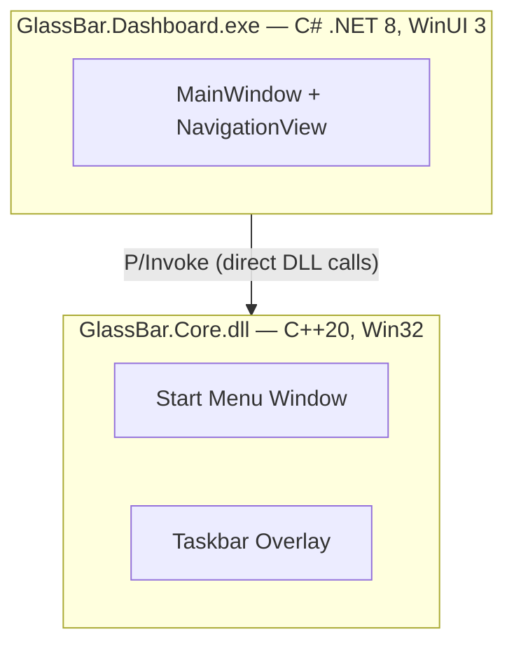

# GlassBar

**Windows 11 Customization Utility** — A transparent, color-customizable overlay for the Taskbar and a complete, functional revival of the Windows 7 Start Menu.


---

## Features

- **Taskbar Overlay** — Semi-transparent color overlay over the Windows 11 Taskbar
- **Windows 7 Start Menu Revival** — A complete, from-scratch reimplementation of the classic Windows 7 Start Menu, replacing the native Windows 11 menu.
  - Two-column layout with pinned/recent programs and system links.
  - Recent programs auto-refresh on every open (Windows UserAssist registry).
  - Right-click pinned items to unpin or pick a custom icon (shell icon picker).
  - Right-click recent items to remove from list (persisted exclusion list).
  - Fully functional "All Programs" tree with folder drill-down.
  - Keyboard navigation, mouse-wheel scroll, and hover-to-open submenus.
  - Dynamic pinned list with right-click context menus to pin/unpin/pin-to-taskbar.
  - Right-column item visibility controlled per-item from the Dashboard.
  - Power/session control submenu (Sleep, Shut down, Restart).
- **Theme Presets** — One-click Classic Win7 / Aero Glass / Dark themes
- **RGB Color Control** — Independent R/G/B sliders for background, text, and border color
- **Opacity Control** — 0–100% adjustable per panel
- **Blur / Acrylic effect** — Optional acrylic blur behind the overlay (per panel)
- **Multi-monitor** — Taskbar overlay on all connected displays (all edges supported)
- **Run at Startup** — Optional auto-start via Windows registry; starts silently in System Tray
- **System Tray icon** — Minimize to tray; right-click menu (Open / Exit); double-click to restore
- **System Theme Support** — Follows Windows light/dark theme automatically
- **Click-Through** — Full Taskbar and Start Menu functionality preserved
- **Explorer Restart Recovery** — Auto re-detects Taskbar/Start after Explorer crashes
- **No Injection** — External overlay only; no system file modifications

---

## Architecture



**GlassBar.Core.dll** — Native DLL (C++20)
- Manages the custom Windows 7 Start Menu window (GDI painting, state, navigation).
- Provides the transparent Taskbar overlay and handles low-level hooks.
- Exports a C API (`CoreApi.h`) consumed by the Dashboard via P/Invoke.

**GlassBar.Dashboard.exe** — Settings UI (C# .NET 8, WinUI 3)
- Single-window compact settings panel with `NavigationView` (Taskbar / Start Menu panels).
- Loads `GlassBar.Core.dll` in-process via P/Invoke — no external process or named pipes.
- Manages Core lifecycle (start/stop toggle) and forwards all settings in real time.

### Technology Stack

| Layer | Technology |
|-------|-----------|
| Core engine | C++20, Win32 API, GDI |
| Dashboard UI | C# .NET 8, WinUI 3, XAML, NavigationView |
| Core↔Dashboard | P/Invoke (direct DLL calls) |
| Build | CMake (Core), dotnet CLI / MSBuild (Dashboard) |

---

## Quick Start

### Prerequisites

- **Windows 11** (22H2 or later recommended)
- **Visual Studio 2022** with C++ Desktop workload (for Core)
- **.NET 8 SDK**
- **CMake 3.20+**

### Build

**Core (C++):**
```cmd
cd Core
cmake -B build -A x64
cmake --build build --config Release
```

**Dashboard (C#):**
```cmd
cd Dashboard
dotnet build -r win-x64 --no-self-contained
```

### Run

```cmd
Dashboard\bin\x64\Release\net8.0-windows10.0.22621.0\win-x64\GlassBar.Dashboard.exe
```

The Dashboard automatically locates and loads `GlassBar.Core.dll` from the same directory.
Click the **Core** toggle → ON to start the overlay engine.

---

## Usage

### Header (always visible)

| Control | Action |
|---------|--------|
| Core status dot | Green = engine running, Gray = stopped |
| Startup toggle | Enable / disable Windows registry autostart |
| Core toggle | Start / stop the overlay engine |

### Taskbar tab

| Control | Action |
|---------|--------|
| Taskbar Overlay toggle | Enable / disable the Taskbar overlay |
| Transparency slider | 0–100% opacity |
| Blur (acrylic) toggle | Enable acrylic blur behind the overlay |
| R / G / B sliders | Background color |
| Color preview bar | Live preview of the selected color |

### Start Menu tab

| Control | Action |
|---------|--------|
| Start Menu toggle | Enable / disable the Start Menu replacement |
| Keep Open for Preview | Pin the menu open to preview effects in real time |
| Transparency slider | 0–100% opacity |
| Blur (acrylic) toggle | Enable acrylic blur behind the Start Menu |
| Background Color sliders | R / G / B for the menu background |
| Text Color sliders | R / G / B for menu text |
| Border / Accent Color | R / G / B for the menu border |
| Right Column Items | Show / hide individual right-column items |
| Theme Presets | Classic Win7 / Aero Glass / Dark — one-click apply |

### Start Menu right-click actions

| Target | Action |
|--------|--------|
| Pinned item | Unpin from Start Menu / Select custom icon |
| Recent item | Remove from list |
| All Programs item | Pin to Start Menu / Pin to Taskbar |

---

## Troubleshooting

**Overlay doesn't appear after enabling Core**
- Wait 1–2 seconds for detection; status indicator turns green when found
- If Taskbar not detected: restart Windows Explorer (Task Manager → Windows Explorer → Restart)
- Logs: `%LOCALAPPDATA%\GlassBar\GlassBar.log`

**Start Menu not appearing**
- Ensure the Start Menu toggle is ON in the Start Menu tab
- Click the Windows Start button to trigger the hook

**Recent programs list is empty**
- Recent items are loaded from the Windows UserAssist registry
- Open a few applications, then re-open the Start Menu — the list refreshes on every open

---

## Performance

| Metric | Target | Measured |
|--------|--------|----------|
| CPU (idle) | < 2% | ~0.5% |
| Memory | < 50 MB | ~30 MB |
| Startup | < 2 s | ~1 s |
| Opacity change latency | < 50 ms | ~16 ms |

---

## Windows Version Compatibility

GlassBar uses different rendering strategies depending on the Windows build, because Microsoft introduced major architectural changes to Taskbar display rendering in 24H2 and 25H2.

| Windows version | Build | Rendering | Transparency | Color tint (RGB) | Blur (Acrylic) | Icon visibility |
|----------------|-------|-----------|-------------|-----------------|----------------|-----------------|
| **22H2** | < 22631 | `SetWindowCompositionAttribute` (SWCA) | ✅ Full control | ✅ Full control | ✅ Full Acrylic | ✅ Icons always fully opaque |
| **23H2** | 22631 | SWCA | ✅ Full control | ✅ Full control | ✅ Full Acrylic | ✅ Icons always fully opaque |
| **24H2 / 25H2+** | ≥ 26000 | `SetLayeredWindowAttributes` (LWA_ALPHA) fallback | ✅ Works | ✅ Works | ⚠️ No effect | ⚠️ Icons fade with transparency |

### Notes on 24H2 / 25H2+

On Windows builds ≥ 26000, Microsoft removed support for SWCA-based transparency on `Shell_TrayWnd`. GlassBar falls back to applying `LWA_ALPHA` directly to the Taskbar window, which means:

- **Transparency works**, but as opacity increases, Taskbar icons become proportionally less visible alongside the background. This is a platform limitation — the entire Taskbar window becomes translucent, not just the background layer.
- **RGB color tint and Blur/Acrylic have no effect** on these builds (DWM ignores them).

This limitation is not unique to GlassBar. As of testing on Windows 25H2 (build 26000+):
- **OpenShell** runs as an application but cannot display any transparency effect on either the Taskbar or Start Menu.
- **TranslucentTB** does not run at all on this build.

On **22H2 and 23H2**, GlassBar's SWCA-based rendering works flawlessly: full transparency + RGB color tint + Acrylic blur with the wallpaper clearly visible through the Taskbar, and all icons remaining fully opaque at any transparency level.

---

## Roadmap

### Done
- Taskbar overlay (all edges + auto-hide support)
- Start Menu replacement (Win7 two-column layout, fully functional)
- Per-channel RGB color control (background + text + border/accent per panel)
- Config persistence (JSON in `%LOCALAPPDATA%\GlassBar\`)
- Explorer restart recovery
- Run at Startup (registry) — starts hidden in System Tray when launched at boot
- System theme (light/dark) support
- System tray icon — minimize to tray; right-click menu (Open / Exit); double-click to restore
- All Programs hierarchical tree with folder drill-down, keyboard nav, mouse-wheel scroll, hover submenus
- Dynamic pinned list — pin/unpin/pin-to-taskbar via right-click; custom icon picker
- Recent programs — auto-refresh on open; right-click "Remove from list"
- Multi-monitor Taskbar overlay
- Blur / Acrylic effect per panel
- Theme presets (Classic Win7 / Aero Glass / Dark)
- Right-column item visibility per-item
- Compact single-window Dashboard with NavigationView (Taskbar / Start Menu panels)

### Planned
- **Global hotkey** — toggle overlays without opening Dashboard
- **Auto-update check** — notify when a new GitHub release is available

---

## Contributing

Contributions welcome via pull requests. Please open an issue first for larger changes.

---

## License

MIT — see [LICENSE](LICENSE) for details.

---

**GlassBar — Made for Windows 11 customization enthusiasts**
